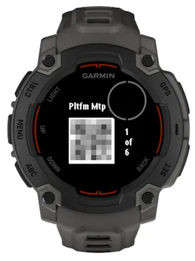

# garmin-qrcode

Me want the qrcode on my wrist.

Api endpoint is from [this repo](https://github.com/kahnwong/qrcode-api).

## Pre-reqs

Specify config variables here: `./resources/properties.xml`.

```xml
<properties>
    <property id="qrcodeImageUrl" type="string"></property>
    <property id="qrcodeTitleUrl" type="string"></property>
    <property id="apiKey" type="string"></property>
</properties>
```

## Screenshot


